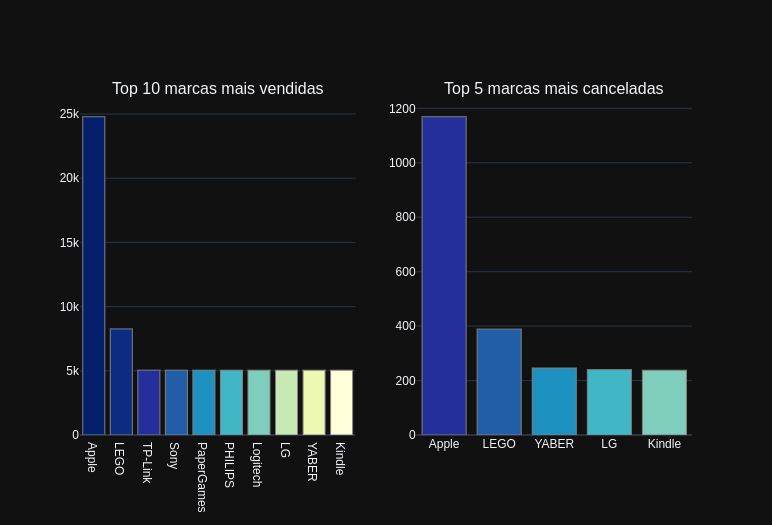
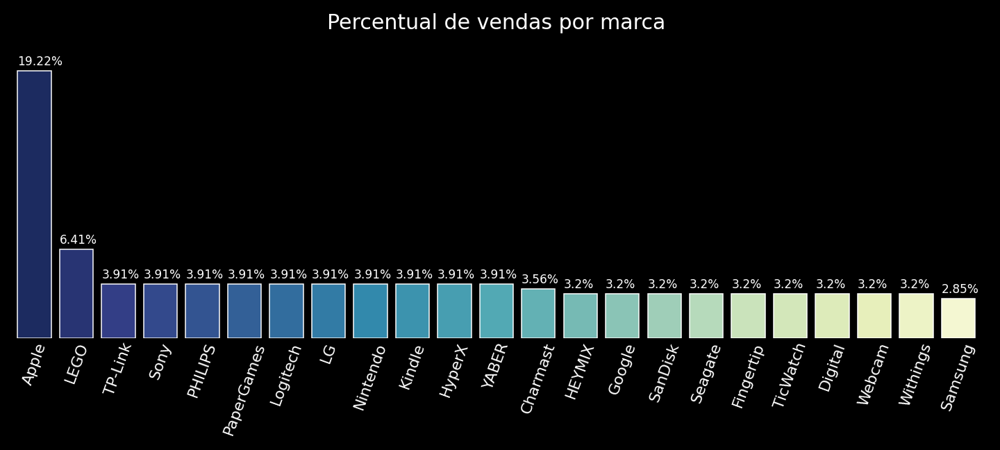
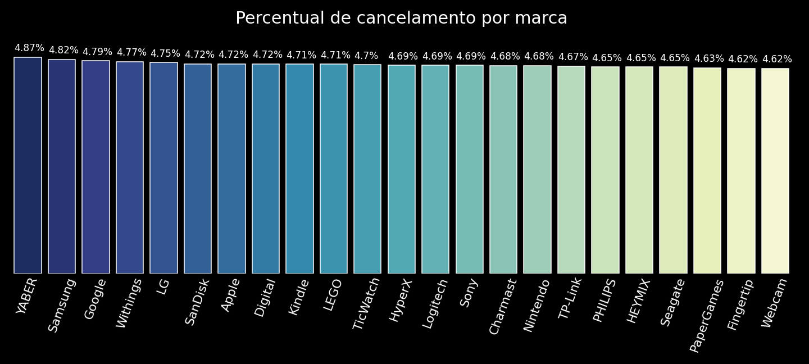

# Descrição
Análise exploratória desenvolvida como Projeto do Módulo: Banco de Dados I. 

A partir de um banco de dados de e-commerce hipotético.

# Roteiro:

1. Criar o banco de dados **e-commerce**

1. Iniciar a conexão com o banco PostgreSQL

1. Criar as tabelas a partir do arquivo **create_tables.py** 

1. Gerar as views que serão utilizadas para fazer as análises:
    * *marcas.sql*
    * *vendas_marcas.sql*
    * *marcas_shipped_cancelled_null.sql*
    * *total_count.sql*

1. Apresentar os insights em **Analysis_Ecommerce.ipynb** 

# Conclusão

As marcas que tiveram maior quantidade de produtos vendidos, também tiveram, como consequência, um maior número de cancelamentos, como podemos perceber abaixo:

  

Agora, olhando para o percentual do total de produtos vendidos, observamos que a maioria das marcas ocupam uma parcela aproximada do montante total das vendas, ou seja, entre 3% e 4%. Excedo pela Apple com cerca de 19% do total das vendas, seguida pela Lego com 6.4%.

  

Por outro lado, quando analisamos, separadamente, o percentual de cancelamento com relação ao percentual de vendas para cada marca, percebemos que este valor é muito próximo para todas as marcas. 

  

Isto é, independente do total de produtos vendidos, o percentual de produtos cancelados é cerca de 5%, para todas as marcas. Consequentemente, em termos de quantidade de produtos, a marca que mais vende é também a com maior volume de cancelamento. Entretanto, isto não é suficiente para afirmar que seu percentual de cancelamentos seja o maior dentre as demais marcas. 

Assim, a YABER, a qual é a marca com maior percentual de cancelamento, não é a marca com maior quantidade de itens entregues. 

